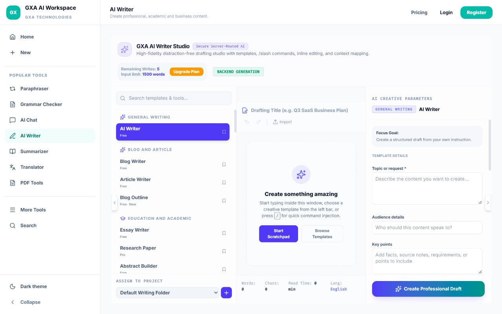
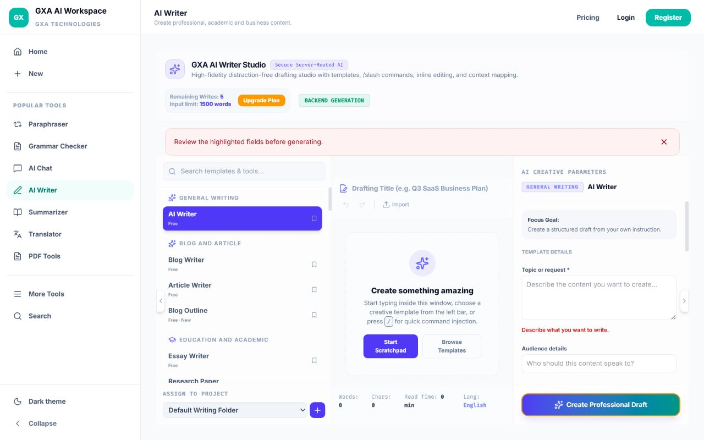
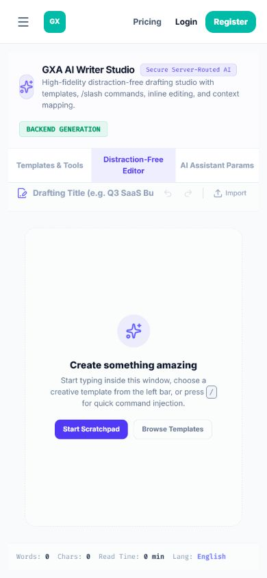
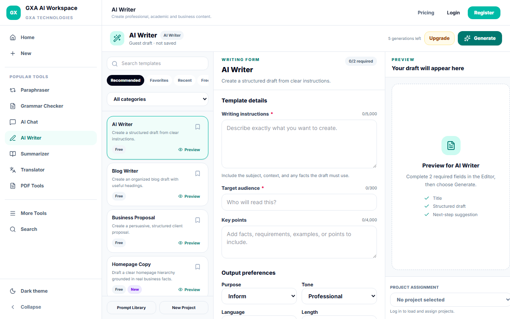
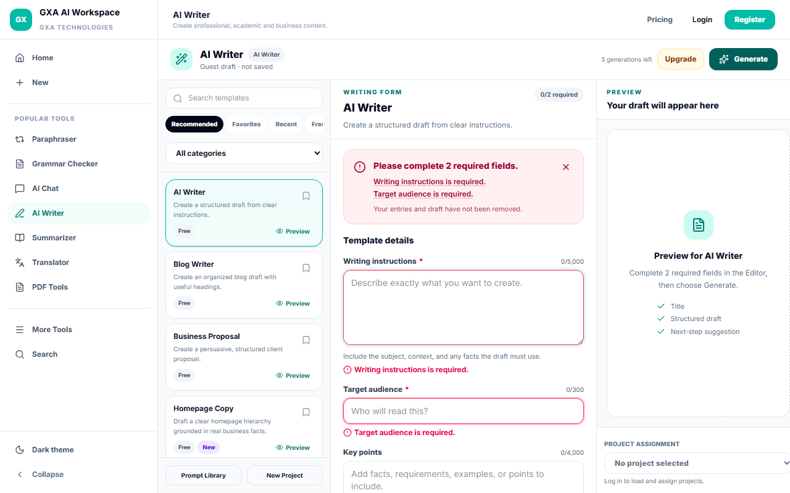
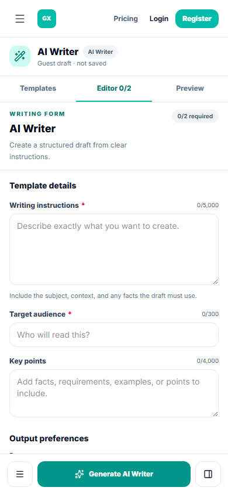
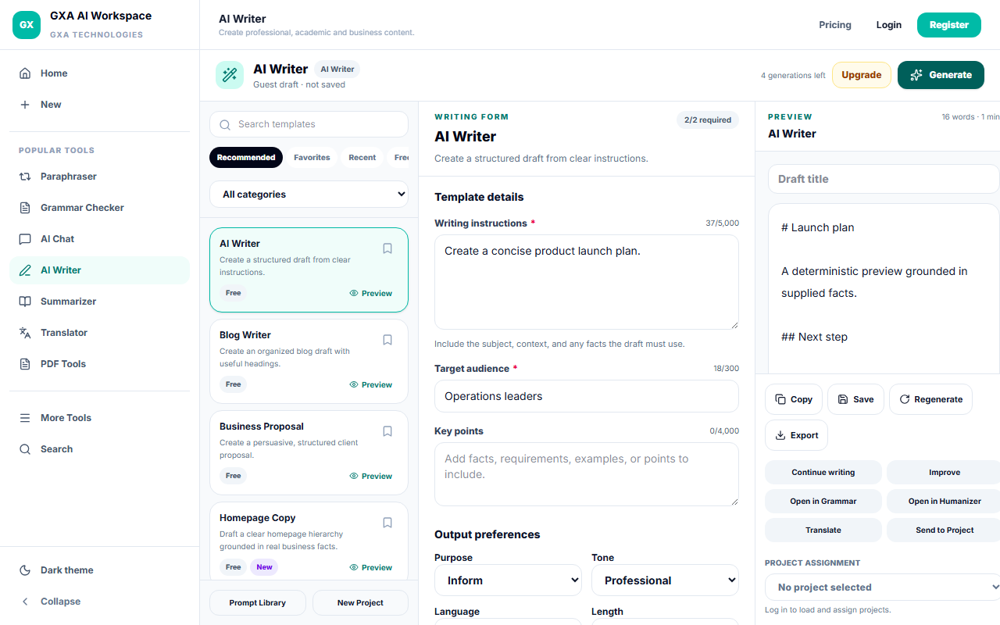

# AI Writer and public workspace UX audit

Audit date: 27 July 2026
Audited base: `888eaf766eec3cdf01a6e3648e0dfc9efa644862`
Scope: public shell, public tools, authentication entry points, Projects guard, Prompt Studio, Templates, pricing/upgrade surfaces, and the complete AI Writer request flow.

## Method and evidence

- Read the route registry, shared shell, tool registry, Writer registry, frontend/backend validation, plan gates, quota handling, project APIs, auth flow, responsive CSS, and existing unit tests.
- Rendered 12 major routes at 1440×1000, 1280×800, 1024×768, 768×1024, 430×932, 390×844, and 360×800.
- Captured 84 before and 84 after route screenshots.
- Added deterministic Writer visual baselines for all seven breakpoints plus validation, completed form, generating, result, and Pro-gate states.
- Exercised keyboard focus, Escape handling, form error associations, guest/authenticated behavior, route recovery, plan gating, project creation, prompt saving, and automated WCAG checks.

## Route audit

| Route or state | Finding | Severity | Classification | Resolution |
| --- | --- | --- | --- | --- |
| Direct `/projects` and `/dashboard` | A guest could briefly/directly enter account-only screens during initial hash restoration. | Critical | Functional bug; backend/frontend mismatch | Route restoration now waits for auth resolution and applies the server-aligned route guard. |
| Protected route → public hash | After a protected route opened Login, a later public hash could remain stuck on Login. | High | Functional bug; misleading state | Public route synchronization now clears stale auth and pending-route state. |
| AI Writer validation | “Review the highlighted fields” did not identify, highlight, associate, or focus missing fields. | High | Validation bug; accessibility problem | All invalid fields are listed, highlighted, associated with inline errors, announced, and the first receives focus. |
| Writer backend validation | Validation stopped at the first invalid field and could return only one field name. | High | Validation bug; backend/frontend mismatch | Backend collects every field error and returns a `fields` map; frontend maps it back to controls. |
| AI Writer desktop/laptop | Oversized introduction and status badges pushed the form below the fold and weakened action hierarchy. | High | Layout problem | Replaced with a compact toolbar, persistent Generate action, and templates/editor/preview workspace. |
| AI Writer mobile | Required inputs and action could be hidden behind a parameter panel; preview location was unclear. | High | Responsive problem; discoverability problem | Added Templates/Editor/Preview tabs, single-column panes, selected-template status, and a sticky Generate action. |
| Writer template forms | One generic schema was reused across materially different templates. | High | Functional bug; duplicate implementation | Central registry now owns tailored field profiles, defaults, messages, output controls, plan, and capability metadata. |
| Writer template discovery | The list lacked meaningful search behavior, previews, favorites/recent filters, and grouped categories. Search remained constrained by the current filter. | High | Discoverability problem | Search now searches all templates; category/view filters, preview dialog, favorites, recent, Free/Pro/New, and honest empty results were added. |
| AI Writer empty/generating/result | Empty preview did not guide setup and states lacked a consistent hierarchy. | High | Misleading state | Added honest empty, generating/cancel, failure, stale-result, quota, offline, and structured result states. |
| Writer terminology | “Secure Server-Routed AI,” “Backend generation,” and “Create Professional Draft” exposed implementation detail or competed with the primary action. | Medium | Inconsistent terminology | Customer-facing states are now Ready, Generating, Saved, Preview, and Generate. |
| Prompt Studio | Claimed “120+” prompts while three built-ins were present, showed rating-like data, and prefilled the builder with sample content. | Medium | Misleading state; discoverability problem | Count now reflects three built-ins, fake ratings and sample inputs are removed, and light-theme contrast is contained. |
| Writer Prompt Library | Guest, empty, and storage-failure states were not distinctly described. | Medium | Misleading state | Added explicit guest, empty, ready, and failed-load states without a fake “0 saved” count. Existing storage keys remain intact. |
| Projects | Placeholder content, “Updated just now,” and inferred sizes made empty projects appear real; load failure could resemble empty state. | Medium | Misleading state | New projects are blank, dates/sizes are derived only from real data, and load/action failures have retryable messages. |
| Templates route | Search claimed 19 templates while six exist; technical labels were unclear; the mobile form area collapsed. | Medium | Layout; responsive; inconsistent terminology | Uses the real count, plain “Generate draft”/“Document preview” labels, accessible contrast, and mobile minimum panel heights. |
| Login/Register | Native required validation bypassed the app’s error summary, and errors were not associated to empty controls. | Medium | Validation bug; accessibility problem | Added explicit customer-facing errors, `aria-invalid`, `aria-describedby`, error clearing, and `noValidate`-backed controlled validation. |
| Writer contrast | Primary teal action and three small counters missed WCAG AA in light mode. | Medium | Accessibility problem | Darkened the primary action and increased counter contrast; automated serious/critical violations are now zero in the Writer scope. |
| Home/Create | The public home uses a large hero but keeps its actual input and tool choices above the fold at audited desktop sizes. | Low | Layout observation | Intentionally not redesigned in this focused PR. |
| Grammar Checker mobile | Input is usable above the fold, while results remain a follow-on section after a check. | Low | Responsive observation | Documented only; no unrelated Grammar redesign. |
| Translator | Controls and both panels fit desktop/laptop; mobile relies on the existing stacked flow. | Low | Responsive observation | Documented only; no unrelated Translator redesign. |
| Writer analytics | No shared product-event contract exists for template preview/search/selection. | Low | Missing instrumentation | Not invented in this PR; server usage metering remains authoritative for generation. |

## AI Writer information architecture

- Desktop (≥1280): compact toolbar, 280 px template rail, flexible form, and preview/output panel.
- Laptop (1024–1279): templates plus one switchable Editor/Preview pane, with Generate always visible.
- Tablet/mobile (<1024): semantic Templates/Editor/Preview tabs and one active pane.
- Mobile: single-column editor, horizontal-free layout, sticky primary action, and accessible pane controls.
- Advanced settings are collapsed by default. Existing TXT/Markdown import remains supported up to 2 MB.
- The preview explains what will appear, names the selected template, and lists the expected structure without fabricated content.

## Template registry audit

All 52 previously registered template IDs remain. Fifty-five supported templates were added, producing 107 templates in 14 categories (79 Free, 28 Pro). Entitlements are registry-driven and revalidated on the server.

Added:

- Website: Homepage Copy, About Us Page, Services Page, FAQ Page, Website Hero Copy.
- SEO: SEO Content Brief, Meta Title Generator, H1/H2 Outline, FAQ Schema Content, Local SEO Page Copy.
- Marketing: Meta Ads Copy, CTA Generator, Email Campaign, Campaign Brief, Marketing Strategy Outline, Carousel Copy, Reel Hooks.
- Social: Facebook Post, Threads Post, YouTube Title, YouTube Description, Reel Caption, Hashtag Generator, Google Business Profile Post.
- E-commerce: Amazon Product Listing, Shopify Product Copy, Etsy Listing, Product Benefits, Product Comparison, Product Review Response.
- HR: Job Description, Interview Questions, Offer Letter Draft, Employee Announcement, Performance Review Draft.
- Startup/business: Investor Pitch, Elevator Pitch, Executive Summary, SWOT Analysis, Business Model Canvas, Client Proposal, Follow-up Message.
- Education: Lesson Plan, Quiz Generator, MCQ Generator, Flashcards, Study Notes, Course Outline.
- Productivity: Meeting Agenda, Action Items, Daily Report, Weekly Report, Monthly Report, Task Breakdown, Process Documentation.

Renamed without changing IDs or saved-data compatibility:

- Newsletter Draft → Newsletter
- Case Study Draft → Case Study
- Invoice Builder → Invoice Descriptions
- SOP Builder (SOP) → Statement of Purpose
- Google Ads → Google Ads Copy
- Twitter/X Thread → X Thread
- Meta Description Generator → Meta Description

Intentionally not added:

- Keyword Cluster and Internal Linking Suggestions: require live search/index evidence not provided by the current Writer architecture.
- Separate Facebook/Instagram/YouTube ad templates: overlap Meta Ads, Google Ads, Carousel, and Reel Hooks without distinct enforced schemas.
- YouTube Shorts Caption and Carousel Content: duplicate Reel Caption and Carousel Copy.
- Flipkart listing: marketplace-specific policy validation is not currently available; the grounded product templates remain usable.
- Product Features, Company Introduction, Quotation Description, Answer Key, and Question Paper: covered by Product Description/Benefits, Company Profile, Invoice Descriptions, Quiz, and MCQ workflows.
- Appointment Letter and Experience Letter: omitted until employment/legal review requirements have a dedicated workflow. Offer Letter is explicitly informational and requires qualified review.
- Legal documents as final advice: deliberately excluded.

## Validation and backend contract

- Every template defines required/optional fields, defaults, messages, output type, export formats, plan, and model-capability key.
- Client validation preserves values, clears corrected errors, focuses the first invalid control, and exposes a screen-reader summary.
- Backend validation rejects unknown templates and fields, collects all field errors, enforces input limits, and never accepts frontend system instructions or provider keys.
- Template plan authorization is enforced before generation; the frontend cannot unlock a Pro template.
- Prompt construction keeps user fields in an untrusted-data block and prohibits invented sources, statistics, credentials, or claims.
- Legal-adjacent drafts are labeled informational and require qualified review.

## Prompt Library and Projects

- Writer prompts continue to use the existing authenticated local-storage keys; no stored prompt is deleted or migrated.
- Guest users receive a clear sign-in explanation. Authenticated empty, ready, and failed-parse states are distinct.
- Project choices come from the authenticated `/api/projects` response only. Create disables repeated submission, selects the returned project, and does not synthesize projects.
- Save/send actions preserve the current draft when auth, project loading, or generation fails.

## Free/Pro gating

- Template plan metadata comes from the shared registry and is checked again by the backend.
- Locked preview explains required fields, setup complexity, output type, and the required plan before opening the centralized upgrade flow.
- Existing pricing values and plan-selection return flow are unchanged.
- Guest form content is preserved through the upgrade interaction.

## Accessibility

- Semantic headings, labeled field groups, associated errors, `aria-invalid`, live generation status, validation summary, and visible focus states.
- Template preview dialogs trap focus, restore focus, and close with Escape.
- Template selection and pane changes are keyboard-operable without drag-only interactions.
- Touch targets are at least 40–44 px for primary mobile controls.
- Reduced-motion rules stop nonessential animation when requested.
- Writer-scoped automated testing reports no serious or critical axe violations in light mode.

## Screenshot evidence

Before:

After:

All visual baselines live in `tests/e2e/ai-writer.visual.spec.ts-snapshots/` and cover seven breakpoints plus validation, valid, generating, result, and Pro gate states.

## Preservation and limitations

- No template ID, generation route, project, prompt, pricing value, entitlement, AI provider behavior, or user-data store was removed.
- Existing Writer local-storage keys and backend endpoints remain compatible.
- No database reset or destructive migration is included.
- Home, Grammar, Chat, Paraphraser, Summarizer, Translator, PDF, Pricing, and provider implementations were audited but not redesigned.
- Prompt Library remains authenticated local storage rather than server-synced storage; this PR makes that behavior honest but does not invent a new persistence API.
- Analytics beyond existing server-side usage metering awaits a shared product analytics contract.
